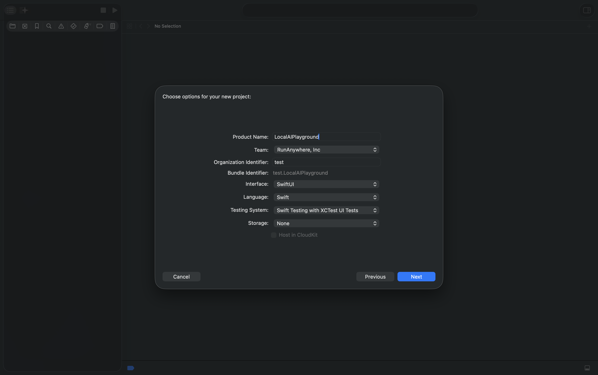
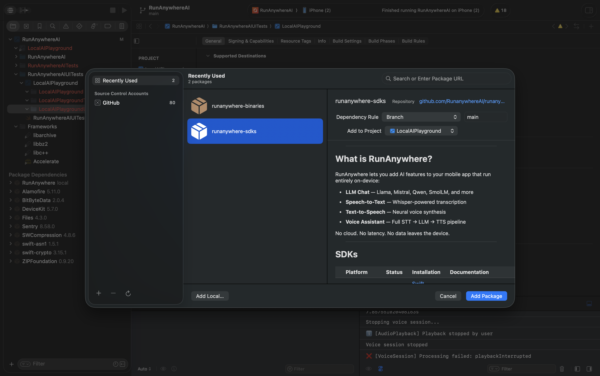
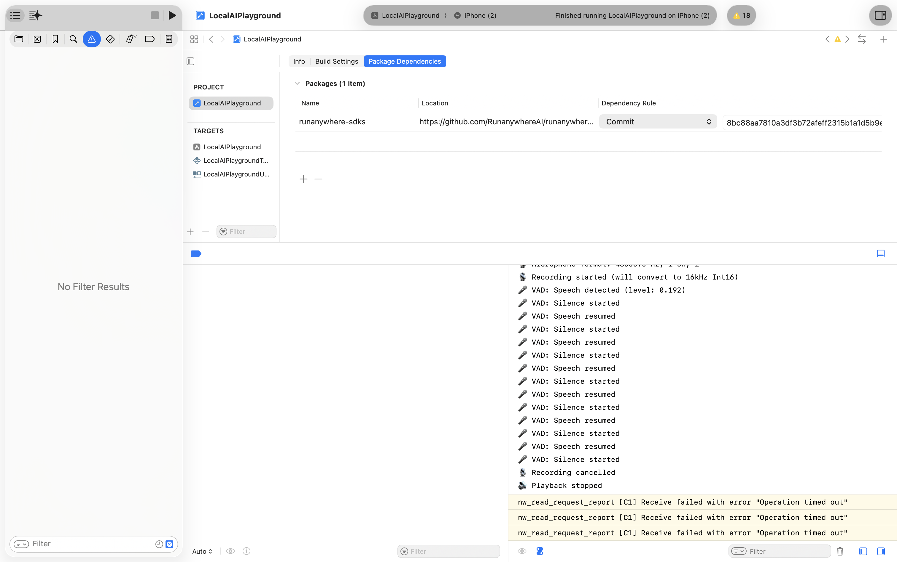
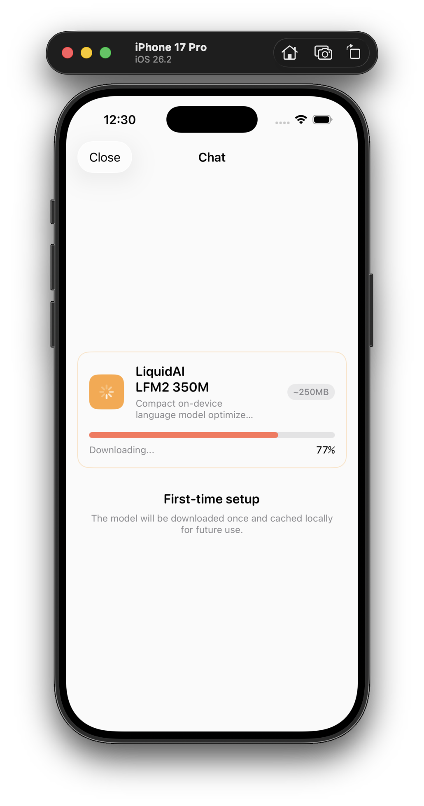
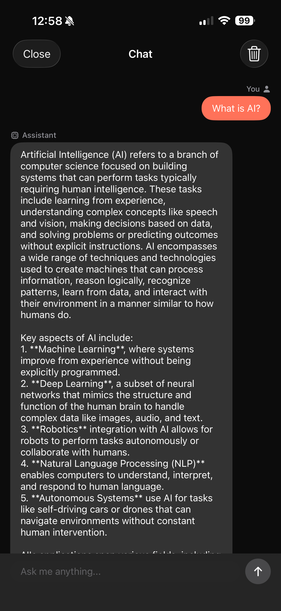
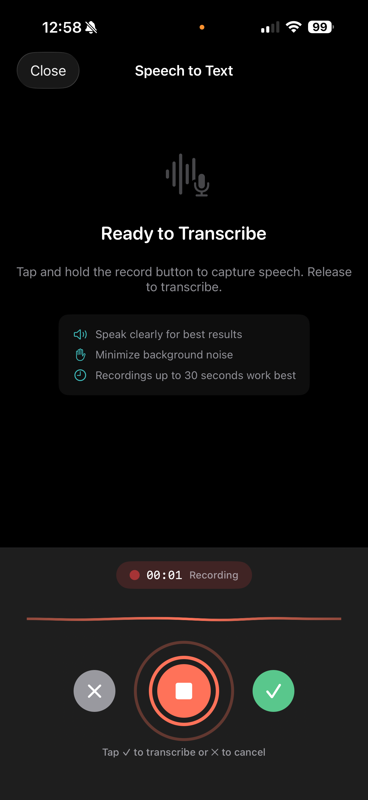
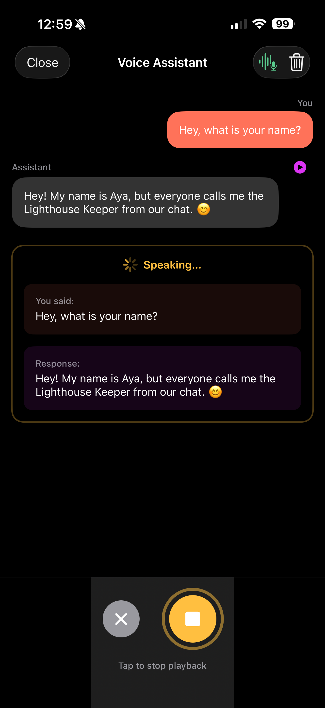

# Building Privacy-First AI Apps with RunAnywhere Swift SDK

**Run LLMs, Speech Recognition, and Voice Synthesis Entirely On-Device**

---

The promise of on-device AI is compelling: instant responses, complete privacy, and no API costs. But implementing it has traditionally been challenging—managing model formats, optimizing for mobile hardware, and handling audio processing correctly.

[RunAnywhere](https://runanywhere.ai) changes this. It's a production-ready SDK that brings powerful AI capabilities to iOS with a simple, unified API. In this tutorial, we'll build a complete AI app that demonstrates:

- **Chat with an LLM** — Streaming text generation with LiquidAI LFM2
- **Speech-to-Text** — Real-time transcription with Whisper
- **Text-to-Speech** — Natural voice synthesis with Piper
- **Voice Pipeline** — A full voice assistant with automatic Voice Activity Detection (VAD)

All processing happens on-device. No data ever leaves the phone.

## Why On-Device AI?

| Aspect | Cloud AI | On-Device AI |
|--------|----------|--------------|
| **Privacy** | Data sent to servers | Data stays on device |
| **Latency** | Network round-trip | Instant local processing |
| **Offline** | Requires internet | Works anywhere |
| **Cost** | Per-request billing | One-time download |

For applications handling sensitive data—health, finance, personal conversations—on-device processing isn't just a feature, it's a requirement.

## Prerequisites

- **Xcode 15.0+** with Swift 5.9
- **iOS 17.0+** device (physical device recommended)
- Basic familiarity with SwiftUI

## Project Setup

### 1. Create a New Xcode Project

Create a new iOS App with SwiftUI interface. Use the following settings:

- **Product Name:** LocalAIPlayground (or your preferred name)
- **Interface:** SwiftUI
- **Language:** Swift
- **Storage:** None



### 2. Add the RunAnywhere SDK

Add via Swift Package Manager:

1. **File → Add Package Dependencies...**
2. Enter: `https://github.com/RunanywhereAI/runanywhere-sdks`
3. For **Dependency Rule**, select **Commit** and enter:
   ```
   8bc88aa7810a3df3b72afeff2315b1a1d5b9e6f0
   ```

   > **Important:** Using a specific commit hash ensures reproducible builds. This pins your project to an exact SDK version, preventing unexpected breaking changes when the SDK updates.

4. Add these products:
   - `RunAnywhere` — Core SDK
   - `RunAnywhereLlamaCPP` — LLM backend
   - `RunAnywhereONNX` — STT/TTS/VAD backend



After adding the package, verify the dependency is configured correctly in your project's **Package Dependencies** tab:



The dependency should show:
- **Name:** runanywhere-sdks
- **Location:** `https://github.com/RunanywhereAI/runanywhere-sdks`
- **Dependency Rule:** Commit → `8bc88aa7810a3df3b72afeff2315b1a1d5b9e6f0`

### 3. Configure Info.plist

Add required permissions:

```xml
<key>NSMicrophoneUsageDescription</key>
<string>This app needs microphone access to transcribe your speech using on-device AI.</string>

<key>CFBundleIdentifier</key>
<string>$(PRODUCT_BUNDLE_IDENTIFIER)</string>

<key>UIBackgroundModes</key>
<array>
    <string>audio</string>
</array>
```

## SDK Initialization

The SDK requires a specific initialization order:

```swift
import SwiftUI
import RunAnywhere
import LlamaCPPRuntime
import ONNXRuntime

@main
struct LocalAIPlaygroundApp: App {
    @StateObject private var modelService = ModelService()
    @State private var isSDKInitialized = false
    
    var body: some Scene {
        WindowGroup {
            Group {
                if isSDKInitialized {
                    ContentView()
                        .environmentObject(modelService)
                } else {
                    ProgressView("Initializing AI...")
                }
            }
            .task { await initializeSDK() }
        }
    }
    
    @MainActor
    private func initializeSDK() async {
        do {
            // Step 1: Initialize core SDK
            try RunAnywhere.initialize(environment: .development)
            
            // Step 2: Register backends BEFORE models
            LlamaCPP.register()  // For LLM
            ONNX.register()      // For STT, TTS, VAD
            
            // Step 3: Register models with URLs
            ModelService.registerDefaultModels()
            
            print("✅ RunAnywhere SDK v\(RunAnywhere.version) initialized")
            isSDKInitialized = true
            
            // Step 4: Check what's already loaded
            await modelService.refreshLoadedStates()
        } catch {
            print("❌ SDK init failed: \(error)")
            isSDKInitialized = true // Show UI anyway
        }
    }
}
```


### Architecture Overview

```
┌─────────────────────────────────────────────────────┐
│                 RunAnywhere Core                     │
│         (Unified API, Model Management)              │
├───────────────────────┬─────────────────────────────┤
│   LlamaCPP Backend    │      ONNX Backend           │
│   ─────────────────   │   ─────────────────         │
│   • Text Generation   │   • Speech-to-Text          │
│   • Chat Completion   │   • Text-to-Speech          │
│   • Streaming         │   • Voice Activity (VAD)    │
└───────────────────────┴─────────────────────────────┘
```

## Model Registration & Loading

Models must be **registered** with URLs before they can be downloaded and loaded:

```swift
// Register an LLM model
RunAnywhere.registerModel(
    id: "lfm2-350m-q4_k_m",
    name: "LiquidAI LFM2 350M",
    url: URL(string: "https://huggingface.co/LiquidAI/LFM2-350M-GGUF/resolve/main/LFM2-350M-Q4_K_M.gguf")!,
    framework: .llamaCpp,
    memoryRequirement: 250_000_000
)

// Register STT model (Whisper)
RunAnywhere.registerModel(
    id: "sherpa-onnx-whisper-tiny.en",
    name: "Whisper Tiny English",
    url: URL(string: "https://github.com/RunanywhereAI/sherpa-onnx/releases/download/runanywhere-models-v1/sherpa-onnx-whisper-tiny.en.tar.gz")!,
    framework: .onnx,
    modality: .speechRecognition,
    artifactType: .archive(.tarGz, structure: .nestedDirectory),
    memoryRequirement: 75_000_000
)

// Register TTS voice (Piper)
RunAnywhere.registerModel(
    id: "vits-piper-en_US-lessac-medium",
    name: "Piper US English",
    url: URL(string: "https://github.com/RunanywhereAI/sherpa-onnx/releases/download/runanywhere-models-v1/vits-piper-en_US-lessac-medium.tar.gz")!,
    framework: .onnx,
    modality: .speechSynthesis,
    artifactType: .archive(.tarGz, structure: .nestedDirectory),
    memoryRequirement: 65_000_000
)
```

### Downloading & Loading Models

```swift
// Download with progress tracking
let progressStream = try await RunAnywhere.downloadModel("lfm2-350m-q4_k_m")
for await progress in progressStream {
    print("Download: \(Int(progress.overallProgress * 100))%")
    if progress.stage == .completed { break }
}

// Load into memory
try await RunAnywhere.loadModel("lfm2-350m-q4_k_m")

// Check if loaded (property, not function)
let isLoaded = await RunAnywhere.isModelLoaded
```



## Feature 1: Chat with LLM

### Streaming Text Generation

```swift
func generateResponse(to prompt: String) async throws -> String {
    let options = LLMGenerationOptions(
        maxTokens: 256,
        temperature: 0.7
    )

    let result = try await RunAnywhere.generateStream(prompt, options: options)
    
    var fullResponse = ""
    for try await token in result.stream {
        fullResponse += token
        // Update UI with each token
        await MainActor.run {
            self.responseText = fullResponse
        }
    }
    
    // Get metrics
    let metrics = try await result.result.value
    print("Speed: \(metrics.tokensPerSecond) tok/s")
    
    return fullResponse
}
```



## Feature 2: Speech-to-Text

### Critical: Audio Format Requirements

Whisper requires **16kHz, mono, 16-bit PCM**. iOS microphones record at 48kHz, so you MUST resample:

```swift
// Use AVAudioConverter for proper resampling
let inputFormat = inputNode.outputFormat(forBus: 0) // 48kHz
let targetFormat = AVAudioFormat(
    commonFormat: .pcmFormatInt16,
    sampleRate: 16000,
    channels: 1,
    interleaved: true
)!

let converter = AVAudioConverter(from: inputFormat, to: targetFormat)!

// In your audio tap callback:
inputNode.installTap(onBus: 0, bufferSize: 4096, format: inputFormat) { buffer, _ in
    // Convert to 16kHz Int16
    let outputBuffer = AVAudioPCMBuffer(pcmFormat: targetFormat, frameCapacity: ...)!
    converter.convert(to: outputBuffer, error: nil) { _, outStatus in
        outStatus.pointee = .haveData
        return buffer
    }
    // Accumulate converted buffers...
}
```

### Transcribing Audio

```swift
// Load STT model
try await RunAnywhere.loadSTTModel(id: "sherpa-onnx-whisper-tiny.en")

// Transcribe audio data (must be 16kHz Int16 PCM)
let text = try await RunAnywhere.transcribe(audioData)
print("Transcription: \(text)")
```



## Feature 3: Text-to-Speech

### Important: Piper Output Format

Piper outputs **Float32 PCM at 22kHz**. You must convert to WAV for `AVAudioPlayer`:

```swift
func playTTSAudio(_ data: Data) throws {
    // Check if already WAV
    let isWAV = data.prefix(4) == Data("RIFF".utf8)
    
    let audioData: Data
    if isWAV {
        audioData = data
    } else {
        // Convert Float32 PCM to Int16 WAV
        audioData = convertFloat32ToWAV(data, sampleRate: 22050)
    }
    
    // Write to temp file (more reliable)
    let tempURL = FileManager.default.temporaryDirectory
        .appendingPathComponent("tts_\(UUID()).wav")
    try audioData.write(to: tempURL)
    
    // Play
    let player = try AVAudioPlayer(contentsOf: tempURL)
    player.play()
}

func convertFloat32ToWAV(_ floatData: Data, sampleRate: Int) -> Data {
    // Convert Float32 samples to Int16
    let sampleCount = floatData.count / 4
    var int16Data = Data()
    
    floatData.withUnsafeBytes { buffer in
        let floats = buffer.bindMemory(to: Float.self)
        for i in 0..<sampleCount {
            let clamped = max(-1, min(1, floats[i]))
            let int16 = Int16(clamped * Float(Int16.max))
            int16Data.append(contentsOf: withUnsafeBytes(of: int16.littleEndian) { Array($0) })
        }
    }
    
    // Add WAV header
    return createWAVHeader(dataSize: int16Data.count, sampleRate: sampleRate) + int16Data
}
```

### Synthesis

```swift
// Load TTS voice
try await RunAnywhere.loadTTSVoice(id: "vits-piper-en_US-lessac-medium")

// Synthesize
let options = TTSOptions(rate: 1.0, pitch: 1.0, volume: 1.0)
let output = try await RunAnywhere.synthesize("Hello world!", options: options)

// output.audioData is Float32 PCM at 22kHz
// output.duration is the audio length in seconds
```


## Feature 4: Voice Pipeline with VAD

The killer feature: a complete voice assistant that **automatically detects when you stop speaking**.

### Energy-Based Voice Activity Detection

```swift
// VAD Configuration
let speechThreshold: Float = 0.02      // Level to detect speech start
let silenceThreshold: Float = 0.01     // Level to detect speech end
let silenceDuration: TimeInterval = 1.5 // Seconds of silence before auto-stop

// VAD State
@State private var isSpeechDetected = false
@State private var silenceStartTime: Date?

// Monitor audio levels
func startVADMonitoring() {
    Timer.scheduledTimer(withTimeInterval: 0.1, repeats: true) { _ in
        let level = audioService.inputLevel
        
        // Detect speech start
        if !isSpeechDetected && level > speechThreshold {
            isSpeechDetected = true
            silenceStartTime = nil
            print("🎤 Speech detected")
        }
        
        // Detect speech end
        if isSpeechDetected {
            if level < silenceThreshold {
                if silenceStartTime == nil {
                    silenceStartTime = Date()
                } else if Date().timeIntervalSince(silenceStartTime!) >= silenceDuration {
                    // Auto-stop and process
                    print("🎤 Auto-stopping after silence")
                    processRecording()
                }
            } else {
                silenceStartTime = nil // Speech resumed
            }
        }
    }
}
```

### Complete Voice Pipeline Flow

```swift
func runVoicePipeline() async throws {
    // 1. Start recording with VAD
    try await audioService.startRecording()
    startVADMonitoring()
    
    // ... VAD auto-stops when user finishes speaking ...
    
    // 2. Get audio and transcribe
    let audioData = try await audioService.stopRecording()
    let userText = try await RunAnywhere.transcribe(audioData)
    
    // 3. Generate LLM response
    let prompt = """
    You are a helpful voice assistant. Keep responses SHORT (2-3 sentences).
    
    User: \(userText)
    Assistant:
    """
    
    var response = ""
    let stream = try await RunAnywhere.generateStream(prompt, options: .init(maxTokens: 100))
    for try await token in stream.stream {
        response += token
    }
    
    // 4. Speak the response
    let speech = try await RunAnywhere.synthesize(response, options: TTSOptions())
    try audioService.playAudio(speech.audioData)
}
```



## Models Reference

| Type | Model ID | Size | Notes |
|------|----------|------|-------|
| **LLM** | `lfm2-350m-q4_k_m` | ~250MB | LiquidAI, fast, efficient |
| **STT** | `sherpa-onnx-whisper-tiny.en` | ~75MB | English, real-time |
| **TTS** | `vits-piper-en_US-lessac-medium` | ~65MB | Natural US English |

## Best Practices

### 1. Preload Models During Onboarding

```swift
// Download all models sequentially (avoids SDK concurrency issues)
await modelService.downloadAndLoadLLM()
await modelService.downloadAndLoadSTT()
await modelService.downloadAndLoadTTS()
```

### 2. Handle Memory Pressure

```swift
// Unload when not needed (no ID parameter - unloads current model)
try await RunAnywhere.unloadModel()
try await RunAnywhere.unloadSTTModel()
try await RunAnywhere.unloadTTSVoice()
```

### 3. Audio Format Gotchas

| Component | Sample Rate | Format | Channels |
|-----------|-------------|--------|----------|
| iOS Mic | 48,000 Hz | Float32 | 1-2 |
| Whisper STT | 16,000 Hz | Int16 | 1 |
| Piper TTS Output | 22,050 Hz | Float32 | 1 |
| AVAudioPlayer | Any | WAV/Int16 | 1-2 |

**Always resample and convert formats!**

### 4. Check Model State Before Operations

Always verify model state before attempting operations:

```swift
var isVoiceAgentReady: Bool {
    isLLMLoaded && isSTTLoaded && isTTSLoaded
}

// In your view
if modelService.isVoiceAgentReady {
    // Safe to run voice pipeline
}
```

### 5. Prevent Concurrent Downloads

Guard against multiple simultaneous downloads of the same model:

```swift
func downloadAndLoadLLM() async {
    guard !isLLMDownloading && !isLLMLoading else { return }
    // ... proceed with download
}
```

### 6. Try-Load-Then-Download Pattern

Provide a smoother UX by trying to load from cache first:

```swift
// Try loading from cache first
do {
    try await RunAnywhere.loadModel(modelId)
    // Success - model was cached
} catch {
    // Not cached - download then load
    let progressStream = try await RunAnywhere.downloadModel(modelId)
    // ... track progress ...
    try await RunAnywhere.loadModel(modelId)
}
```

## Complete Source Code

The full source code is available on GitHub:

📦 **[LocalAIPlayground](https://github.com/your-username/LocalAIPlayground)**

Includes:
- Complete SwiftUI app with all features
- Proper audio handling with resampling
- VAD implementation for hands-free operation
- Reusable components and design system
- Detailed code comments

## Conclusion

RunAnywhere makes on-device AI accessible. With proper initialization, audio handling, and the right model formats, you can build:

- ✅ Private, offline chat with LLMs
- ✅ Real-time speech recognition
- ✅ Natural voice synthesis
- ✅ Complete voice assistants with VAD

All running locally on iOS, respecting user privacy.

---

## Resources

- [RunAnywhere Documentation](https://docs.runanywhere.ai)
- [SDK Repository](https://github.com/RunanywhereAI/runanywhere-sdks)
- [Swift Starter Example](https://github.com/RunanywhereAI/swift-starter-example)

---

*Questions? Open an issue on GitHub or reach out on [Twitter/X](https://twitter.com/runanywhere_ai).*
