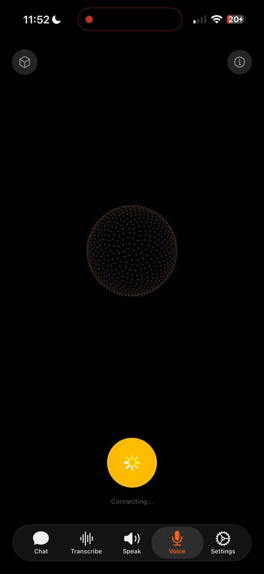
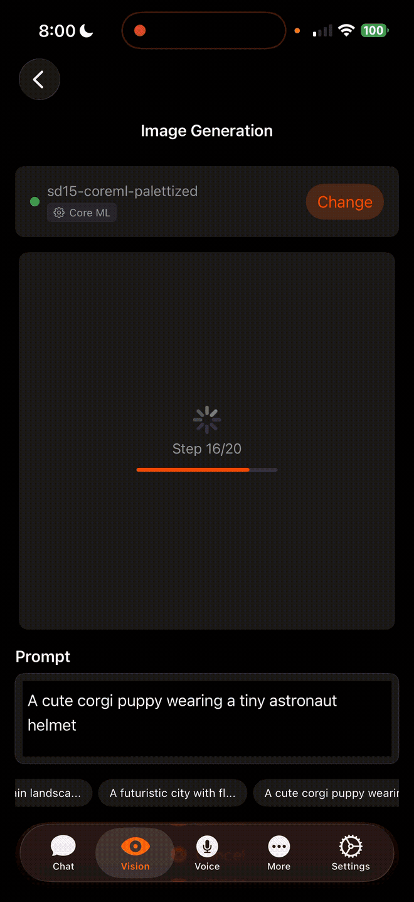

<p align="center">
  
</p>

<h1 align="center">RunAnywhere</h1>

<p align="center">
  <strong>On-device AI for every platform.</strong><br/>
  Run LLMs, speech-to-text, and text-to-speech locally — private, offline, fast.
</p>

<p align="center">
  <a href="https://apps.apple.com/us/app/runanywhere/id6756506307">
    
  </a>
  &nbsp;
  <a href="https://play.google.com/store/apps/details?id=com.runanywhere.runanywhereai">
    
  </a>
</p>

<p align="center">
  <a href="https://github.com/RunanywhereAI/runanywhere-sdks/stargazers"></a>
  <a href="LICENSE"></a>
  <a href="https://discord.gg/N359FBbDVd"></a>
</p>

## See It In Action

<div align="center">
<table>
  <tr>
    <td align="center" width="50%">
      <br/><br/>
      <strong>Text Generation</strong><br/>
      <sub>LLM inference — 100% on-device</sub>
    </td>
    <td width="40"></td>
    <td align="center" width="50%">
      <br/><br/>
      <strong>Voice AI</strong><br/>
      <sub>STT → LLM → TTS pipeline — fully offline</sub>
    </td>
  </tr>
  <tr><td colspan="3" height="30"></td></tr>
  <tr>
    <td align="center" width="50%">
      <br/><br/>
      <strong>Image Generation</strong><br/>
      <sub>On-device diffusion model</sub>
    </td>
    <td width="40"></td>
    <td align="center" width="50%">
      <br/><br/>
      <strong>Visual Language Model</strong><br/>
      <sub>Vision + language understanding on-device</sub>
    </td>
  </tr>
</table>
</div>

---

## What is RunAnywhere?

RunAnywhere lets you add AI features to your app that run entirely on-device:

- **LLM Chat** — Llama, Mistral, Qwen, SmolLM, and more
- **Speech-to-Text** — Whisper-powered transcription
- **Text-to-Speech** — Neural voice synthesis
- **Voice Assistant** — Full STT → LLM → TTS pipeline

No cloud. No latency. No data leaves the device.

---

## SDKs

| Platform | Status | Installation | Documentation |
|----------|--------|--------------|---------------|
| **Swift** (iOS/macOS) | Stable | [Swift Package Manager](#swift-ios--macos) | [docs.runanywhere.ai/swift](https://docs.runanywhere.ai/swift/introduction) |
| **Kotlin** (Android) | Stable | [Gradle](#kotlin-android) | [docs.runanywhere.ai/kotlin](https://docs.runanywhere.ai/kotlin/introduction) |
| **Web** (Browser) | Beta | [npm](#web-browser) | [SDK README](sdk/runanywhere-web/) |
| **React Native** | Beta | [npm](#react-native) | [docs.runanywhere.ai/react-native](https://docs.runanywhere.ai/react-native/introduction) |
| **Flutter** | Beta | [pub.dev](#flutter) | [docs.runanywhere.ai/flutter](https://docs.runanywhere.ai/flutter/introduction) |

---

## Quick Start

### Swift (iOS / macOS)

```swift
import RunAnywhere
import LlamaCPPRuntime

// 1. Initialize
LlamaCPP.register()
try RunAnywhere.initialize()

// 2. Load a model
try await RunAnywhere.downloadModel("smollm2-360m")
try await RunAnywhere.loadModel("smollm2-360m")

// 3. Generate
let response = try await RunAnywhere.chat("What is the capital of France?")
print(response) // "Paris is the capital of France."
```

**Install via Swift Package Manager:**

```
https://github.com/RunanywhereAI/runanywhere-sdks
```

[Full documentation →](https://docs.runanywhere.ai/swift/introduction) · [Source code](sdk/runanywhere-swift/)

---

### Kotlin (Android)

```kotlin
import com.runanywhere.sdk.public.RunAnywhere
import com.runanywhere.sdk.public.extensions.*

// 1. Initialize
LlamaCPP.register()
RunAnywhere.initialize(environment = SDKEnvironment.DEVELOPMENT)

// 2. Load a model
RunAnywhere.downloadModel("smollm2-360m").collect { println("${it.progress * 100}%") }
RunAnywhere.loadLLMModel("smollm2-360m")

// 3. Generate
val response = RunAnywhere.chat("What is the capital of France?")
println(response) // "Paris is the capital of France."
```

**Install via Gradle:**

```kotlin
dependencies {
    implementation("com.runanywhere.sdk:runanywhere-kotlin:0.16.1")
    implementation("com.runanywhere.sdk:runanywhere-core-llamacpp:0.16.1")
}
```

[Full documentation →](https://docs.runanywhere.ai/kotlin/introduction) · [Source code](sdk/runanywhere-kotlin/)

---

### React Native

```typescript
import { RunAnywhere, SDKEnvironment } from '@runanywhere/core';
import { LlamaCPP } from '@runanywhere/llamacpp';

// 1. Initialize
await RunAnywhere.initialize({ environment: SDKEnvironment.Development });
LlamaCPP.register();

// 2. Load a model
await RunAnywhere.downloadModel('smollm2-360m');
await RunAnywhere.loadModel('smollm2-360m');

// 3. Generate
const response = await RunAnywhere.chat('What is the capital of France?');
console.log(response); // "Paris is the capital of France."
```

**Install via npm:**

```bash
npm install @runanywhere/core @runanywhere/llamacpp
```

[Full documentation →](https://docs.runanywhere.ai/react-native/introduction) · [Source code](sdk/runanywhere-react-native/)

---

### Flutter

```dart
import 'package:runanywhere/runanywhere.dart';
import 'package:runanywhere_llamacpp/runanywhere_llamacpp.dart';

// 1. Initialize
await RunAnywhere.initialize();
await LlamaCpp.register();

// 2. Load a model
await RunAnywhere.downloadModel('smollm2-360m');
await RunAnywhere.loadModel('smollm2-360m');

// 3. Generate
final response = await RunAnywhere.chat('What is the capital of France?');
print(response); // "Paris is the capital of France."
```

**Install via pub.dev:**

```yaml
dependencies:
  runanywhere: ^0.16.0
  runanywhere_llamacpp: ^0.16.0  # LLM text generation
  # runanywhere_onnx: ^0.16.0   # Add this if you need STT, TTS, or Voice features
```

[Full documentation →](https://docs.runanywhere.ai/flutter/introduction) · [Source code](sdk/runanywhere-flutter/)

---

### Web (Browser)

```typescript
import { RunAnywhere, TextGeneration } from '@runanywhere/web';

// 1. Initialize
await RunAnywhere.initialize({ environment: 'development' });

// 2. Load a model
await TextGeneration.loadModel('/models/qwen2.5-0.5b-instruct-q4_0.gguf', 'qwen2.5-0.5b');

// 3. Generate
const result = await TextGeneration.generate('What is the capital of France?');
console.log(result.text); // "Paris is the capital of France."
```

**Install via npm:**

```bash
npm install @runanywhere/web
```

[Full documentation →](sdk/runanywhere-web/) · [Source code](sdk/runanywhere-web/)

---

## Sample Apps

Full-featured demo applications demonstrating SDK capabilities:

| Platform | Source Code | Download |
|----------|-------------|----------|
| iOS | [examples/ios/RunAnywhereAI](examples/ios/RunAnywhereAI/) | [App Store](https://apps.apple.com/us/app/runanywhere/id6756506307) |
| Android | [examples/android/RunAnywhereAI](examples/android/RunAnywhereAI/) | [Google Play](https://play.google.com/store/apps/details?id=com.runanywhere.runanywhereai) |
| Web | [examples/web/RunAnywhereAI](examples/web/RunAnywhereAI/) | Build from source |
| React Native | [examples/react-native/RunAnywhereAI](examples/react-native/RunAnywhereAI/) | Build from source |
| Flutter | [examples/flutter/RunAnywhereAI](examples/flutter/RunAnywhereAI/) | Build from source |

---

## Starter Examples

Minimal starter projects to get up and running with RunAnywhere on each platform:

| Platform | Repository |
|----------|------------|
| Kotlin (Android) | [RunanywhereAI/kotlin-starter-example](https://github.com/RunanywhereAI/kotlin-starter-example) |
| Swift (iOS) | [RunanywhereAI/swift-starter-example](https://github.com/RunanywhereAI/swift-starter-example) |
| Flutter | [RunanywhereAI/flutter-starter-example](https://github.com/RunanywhereAI/flutter-starter-example) |
| React Native | [RunanywhereAI/react-native-starter-app](https://github.com/RunanywhereAI/react-native-starter-app) |

---

## Playground

Real-world projects built with RunAnywhere that push the boundaries of on-device AI. Each one ships as a standalone app you can build and run.

### [Android Use Agent](Playground/android-use-agent/)

A fully on-device autonomous Android agent that controls your phone. Give it a goal like "Open YouTube and search for lofi music" and it reads the screen via the Accessibility API, reasons about the next action with an on-device LLM (Qwen3-4B), and executes taps, swipes, and text input -- all without any cloud calls. Includes a Samsung foreground boost that delivers a 15x inference speedup, smart pre-launch via Android intents, and loop detection with automatic recovery. Benchmarked across four LLM models on a Galaxy S24. **[Full benchmarks](Playground/android-use-agent/ASSESSMENT.md)**

### [On-Device Browser Agent](Playground/on-device-browser-agent/)

A Chrome extension that automates browser tasks entirely on-device using WebLLM and WebGPU. Uses a two-agent architecture -- a Planner that breaks down goals into steps and a Navigator that interacts with page elements -- with both DOM-based and vision-based page understanding. Includes site-specific workflows for Amazon, YouTube, and more. All AI inference runs locally on your GPU after the initial model download.

### [Swift Starter App](Playground/swift-starter-app/)

A full-featured iOS app demonstrating the RunAnywhere SDK's core AI capabilities in a clean SwiftUI interface. Includes LLM chat with on-device language models, Whisper-powered speech-to-text, neural text-to-speech, and a complete voice pipeline that chains STT, LLM, and TTS together with voice activity detection. A good starting point for building privacy-first AI features on iOS.

### [Linux Voice Assistant](Playground/linux-voice-assistant/)

A complete on-device voice AI pipeline for Linux (Raspberry Pi 5, x86_64, ARM64). Say "Hey Jarvis" to activate, speak naturally, and get responses -- all running locally with zero cloud dependency. Chains Wake Word detection (openWakeWord), Voice Activity Detection (Silero VAD), Speech-to-Text (Whisper Tiny EN), LLM reasoning (Qwen2.5 0.5B Q4), and Text-to-Speech (Piper neural TTS) in a single C++ binary.

### [OpenClaw Hybrid Assistant](Playground/openclaw-hybrid-assistant/)

A hybrid voice assistant that keeps latency-sensitive components on-device (wake word, VAD, STT, TTS) while routing reasoning to a cloud LLM via OpenClaw WebSocket. Supports barge-in (interrupt TTS by saying the wake word), waiting chimes for cloud response feedback, and noise-robust VAD with burst filtering. Built for scenarios where on-device LLMs are too slow but you still want private audio processing.

---

## Features

| Feature | iOS | Android | Web | React Native | Flutter |
|---------|-----|---------|-----|--------------|---------|
| LLM Text Generation | ✅ | ✅ | ✅ | ✅ | ✅ |
| Streaming | ✅ | ✅ | ✅ | ✅ | ✅ |
| Speech-to-Text | ✅ | ✅ | ✅ | ✅ | ✅ |
| Text-to-Speech | ✅ | ✅ | ✅ | ✅ | ✅ |
| Voice Assistant Pipeline | ✅ | ✅ | ✅ | ✅ | ✅ |
| Vision Language Models | ✅ | — | ✅ | — | — |
| Model Download + Progress | ✅ | ✅ | ✅ | ✅ | ✅ |
| Structured Output (JSON) | ✅ | ✅ | ✅ | 🔜 | 🔜 |
| Tool Calling | ✅ | ✅ | ✅ | — | — |
| Embeddings | — | — | ✅ | — | — |
| Apple Foundation Models | ✅ | — | — | — | — |

---

## Supported Models

### LLM (GGUF format via llama.cpp)

| Model | Size | RAM Required | Use Case |
|-------|------|--------------|----------|
| SmolLM2 360M | ~400MB | 500MB | Fast, lightweight |
| Qwen 2.5 0.5B | ~500MB | 600MB | Multilingual |
| Llama 3.2 1B | ~1GB | 1.2GB | Balanced |
| Mistral 7B Q4 | ~4GB | 5GB | High quality |

### Speech-to-Text (Whisper via ONNX)

| Model | Size | Languages |
|-------|------|-----------|
| Whisper Tiny | ~75MB | English |
| Whisper Base | ~150MB | Multilingual |

### Text-to-Speech (Piper via ONNX)

| Voice | Size | Language |
|-------|------|----------|
| Piper US English | ~65MB | English (US) |
| Piper British English | ~65MB | English (UK) |

---

## Repository Structure

```
runanywhere-sdks/
├── sdk/
│   ├── runanywhere-swift/          # iOS/macOS SDK
│   ├── runanywhere-kotlin/         # Android SDK
│   ├── runanywhere-web/            # Web SDK (WebAssembly)
│   ├── runanywhere-react-native/   # React Native SDK
│   ├── runanywhere-flutter/        # Flutter SDK
│   └── runanywhere-commons/        # Shared C++ core
│
├── examples/
│   ├── ios/RunAnywhereAI/          # iOS sample app
│   ├── android/RunAnywhereAI/      # Android sample app
│   ├── web/RunAnywhereAI/          # Web sample app
│   ├── react-native/RunAnywhereAI/ # React Native sample app
│   └── flutter/RunAnywhereAI/      # Flutter sample app
│
├── Playground/
│   ├── swift-starter-app/          # iOS AI playground app
│   ├── on-device-browser-agent/    # Chrome browser automation agent
│   ├── android-use-agent/          # On-device autonomous Android agent
│   ├── linux-voice-assistant/      # Linux on-device voice assistant
│   └── openclaw-hybrid-assistant/  # Hybrid voice assistant (on-device + cloud)
│
└── docs/                           # Documentation
```

---

## Requirements

| Platform | Minimum | Recommended |
|----------|---------|-------------|
| iOS | 17.0+ | 17.0+ |
| macOS | 14.0+ | 14.0+ |
| Android | API 24 (7.0) | API 28+ |
| Web | Chrome 96+ / Edge 96+ | Chrome 120+ |
| React Native | 0.74+ | 0.76+ |
| Flutter | 3.10+ | 3.24+ |

**Memory:** 2GB minimum, 4GB+ recommended for larger models

---

## Contributing

We welcome contributions. See our [Contributing Guide](CONTRIBUTING.md) for details.

```bash
# Clone the repo
git clone https://github.com/RunanywhereAI/runanywhere-sdks.git

# Set up a specific SDK (example: Swift)
cd runanywhere-sdks/sdk/runanywhere-swift
./scripts/build-swift.sh --setup

# Run the sample app
cd ../../examples/ios/RunAnywhereAI
open RunAnywhereAI.xcodeproj
```

---

## Support

- **Discord:** [Join our community](https://discord.gg/N359FBbDVd)
- **GitHub Issues:** [Report bugs or request features](https://github.com/RunanywhereAI/runanywhere-sdks/issues)
- **Email:** founders@runanywhere.ai
- **Twitter:** [@RunanywhereAI](https://twitter.com/RunanywhereAI)

---

## License

Apache 2.0 — see [LICENSE](LICENSE) for details.
